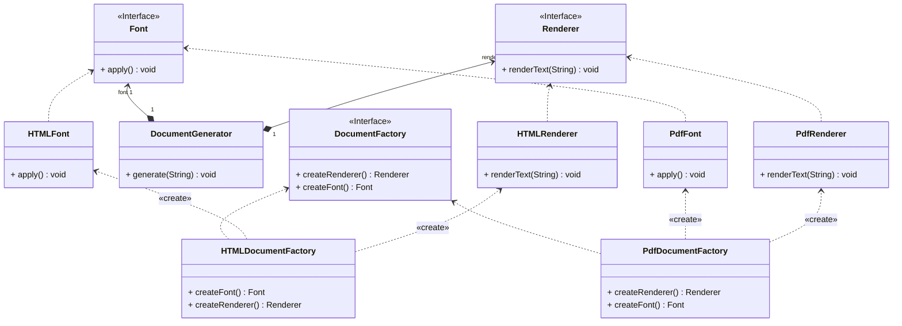

## Data types

`char`  8 bits = 1 byte
    
    - unsigned char: 0 - 255
    - [signed] char: -128 - 127

`short` 16 bits = 2 bytes

    - unsigned short: 0 - 65,535
    - short: -32,768 - 32,767

`int` 32 bits = 4 bytes

    - unsigned: 0 - 4,294,967,295
    - int: -2,147,483,648 - 2,147,483,647

`long` 64 bits = 8 bytes

    - unsigned long: 0 - 18,446,744,073,709,551,615
    - long: -9,223,372,036,854,775,808 - 9,223,372,036,854,775,807

## Encodings

- Define function Binary to Unsigned $$B2U_w(\vec{x}) = \sum_{i=0}^{w-1}x_i2^i$$ for $\vec{x}=[x_{w-1}, x_{w-2}, \dots, x_0]$
    - Min value = 0
    - Max value = $2^w-1$

- Define function Binary to Two's Complement $$B2T_w(\vec{x}) = -x_{w-1}\cdot2^{w-1}+\sum_{i=0}^{w-2}x_i2^i$$ for $\vec{x}=[x_{w-1}, x_{w-2}, \dots, x_0]$
    - Min value = $-2^w-1$
    - Max value = $2^{w-1}-1$

## Conversion between Signed and Unsigned

- Principle: Bit representation does not change

- Signed to unsigned conversion: $$T2U_w(x) = \begin{cases} 
x+2^w & x < 0 \\
x & x \geq 0
\end{cases}$$
for $-2^w-1 \leq x \leq 2^{w-1}-1$.

- Unsigned to signed conversion:
2^{w-1}-1\end{cases}" title="\begin{cases}u&u\leq 2^{w-1}-1\\u-2^w&u>2^{w-1}-1\end{cases}" />

## MERMAID

